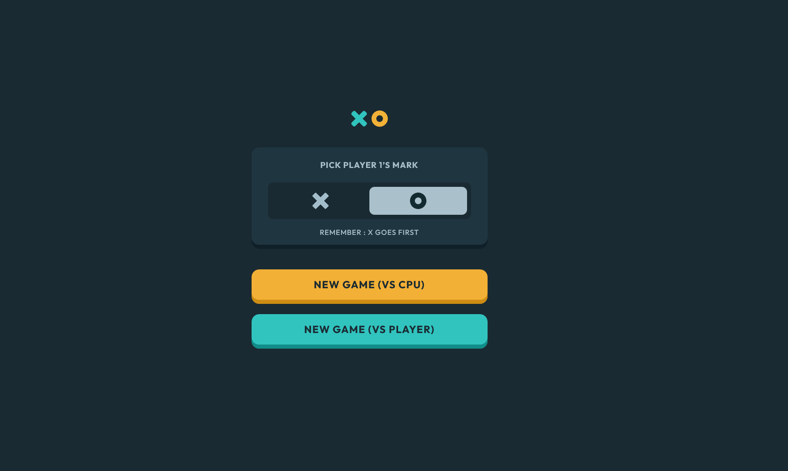
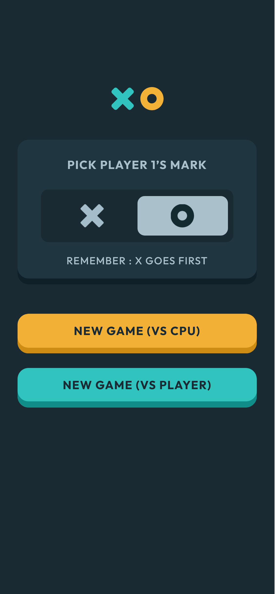

# Frontend Mentor - Tic Tac Toe solution

This is a solution to the [Tic Tac Toe challenge on Frontend Mentor](https://www.frontendmentor.io/challenges/tic-tac-toe-game-Re7ZF_E2v). Frontend Mentor challenges help you improve your coding skills by building realistic projects.

## Table of contents

- [Overview](#overview)
  - [The challenge](#the-challenge)
  - [Screenshot](#screenshot)
  - [Links](#links)
- [My process](#my-process)
  - [Built with](#built-with)
- [Author](#author)
- [Acknowledgments](#acknowledgments)

**Note: Delete this note and update the table of contents based on what sections you keep.**

## Overview

### The challenge

Users should be able to:

- ✅ View the optimal layout for the game depending on their device's screen size
- ✅ See hover states for all interactive elements on the page
- ✅ Play the game either solo vs the computer or multiplayer against another person
- **[Ongoing]** **Bonus 1**: Save the game state in the browser so that it’s preserved if the player refreshes their browser
- ✅ **Bonus 2**: Instead of having the computer randomly make their moves, try making it clever so it’s proactive in blocking your moves and trying to win

### Screenshot

**Desktop** (1440px)

**Mobile** (375px)

### Links

- Solution URL: [GitHub](https://github.com/marcfranciss/Tic-tac-toe-game.git)
- Live Site URL: [GitHub Pages](https://marcfranciss.github.io/Tic-tac-toe-game)

## My process

### Built with

- Semantic HTML5 markup
- Flexbox
- **[Sass](https://sass-lang.com/documentation/)**
- **[React](https://reactjs.org/)**
- **[Typescript](https://www.typescriptlang.org/docs/handbook/intro.html)**
- **[Vite](https://vitejs.dev/guide/)**

## Author

- Website - [mackersdev.net](https://www.mackersdev.net)
- Frontend Mentor - [@marcfranciss](https://www.frontendmentor.io/profile/marcfranciss)

## Acknowledgments

Thank you for checking out this very simple project!

**Cheers!** 🍻
